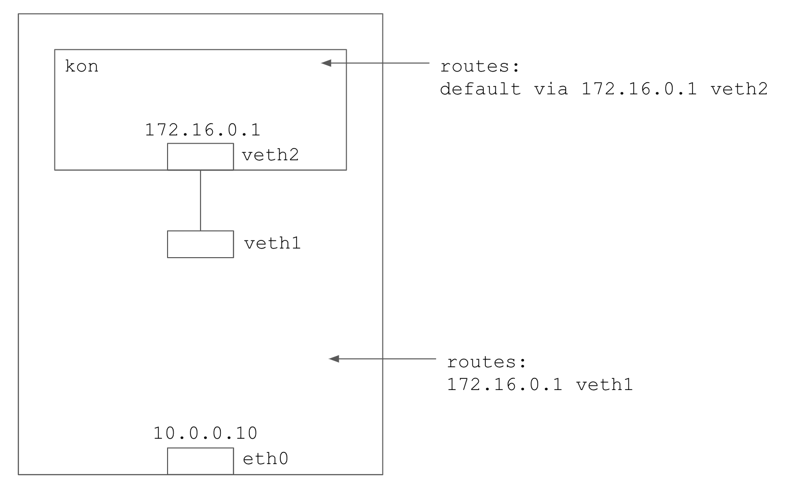

# Network Namespace

An example of creating a simple network namespace connected
to the host via a veth pair.



Create the VM:

```
vagrant up
```

SSH to the VM and run the setup script to create the network namespace and the veth pair: 

```
vagrant ssh
./setup.sh
```

To test the connectivity between the node and the namespace, run the following:

```
./test.sh
```

To teardown the network:

```
./teardown.sh
```

To test the entire flow, i.e. setup - run the tests - teardown, from your machine, run the following:

```
make
```
